# Interlock — System Diagrams

Visual reference for the whole platform. Every diagram is **Mermaid** (renders natively in GitHub / VS Code / most markdown viewers).

Use the **Feature Coverage Matrix at the bottom** (§13) to confirm every feature from `backend/technical_architecture.docx` is accounted for.

---

## Quick Index

| # | Diagram | What it shows |
|---|---|---|
| 1 | [Big picture — 3-plane system](#1-big-picture--3-plane-system) | Everything connected: planes, services, data flows |
| 2 | [Move object model (ER)](#2-move-object-model-er) | The 6 on-chain objects and their references |
| 3 | [Workflow lifecycle (sequence)](#3-workflow-lifecycle-sequence) | The 7 stages from quote → settlement |
| 4 | [Workflow state machine](#4-workflow-state-machine) | Status transitions on `Workflow.status` |
| 5 | [Settlement algorithm (flowchart)](#5-settlement-algorithm-flowchart) | §10 visualized — all bound checks + atomic disbursement |
| 6 | [Outcome verification (flowchart)](#6-outcome-verification-flowchart) | §11 visualized — deterministic + Phase-2 multi-LLM voting |
| 7 | [Success criteria DSL tree](#7-success-criteria-dsl-tree) | The criteria predicate algebra |
| 8 | [Money flow (USDC)](#8-money-flow-usdc) | Escrow → atomic multi-party splits |
| 9 | [Trust boundaries](#9-trust-boundaries) | Who is trusted for what (and what they're not trusted for) |
| 10 | [Frontend route map](#10-frontend-route-map) | All Next.js pages and their roles |
| 11 | [Build phase timeline (Gantt)](#11-build-phase-timeline-gantt) | 24-week MVP plan |
| 12 | [Repository layout](#12-repository-layout) | Target directory tree |
| 13 | [Feature coverage matrix](#13-feature-coverage-matrix) | Every feature from the doc → where it lives |

---

## 1. Big picture — 3-plane system

The whole platform in one view. **Solid arrows** = primary data flow. **Dashed arrows** = event subscriptions / indirect reads.

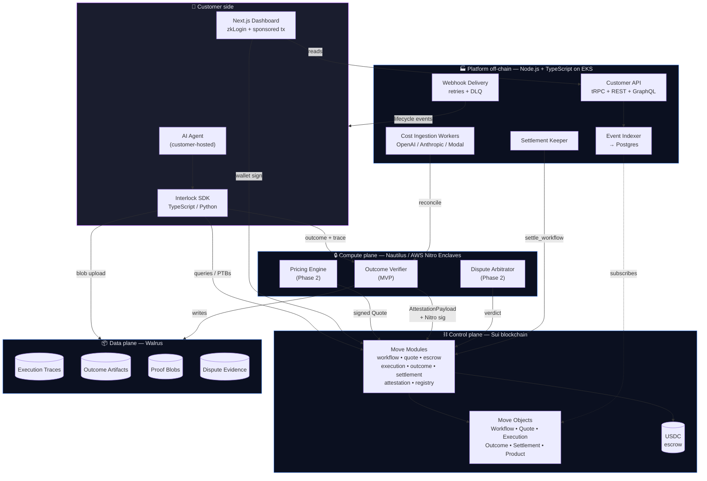

---

## 2. Move object model (ER)

The six on-chain objects and how they reference each other. **`||`** = exactly one; **`o|`** = optional; **`|{`** = one-to-many (vector).

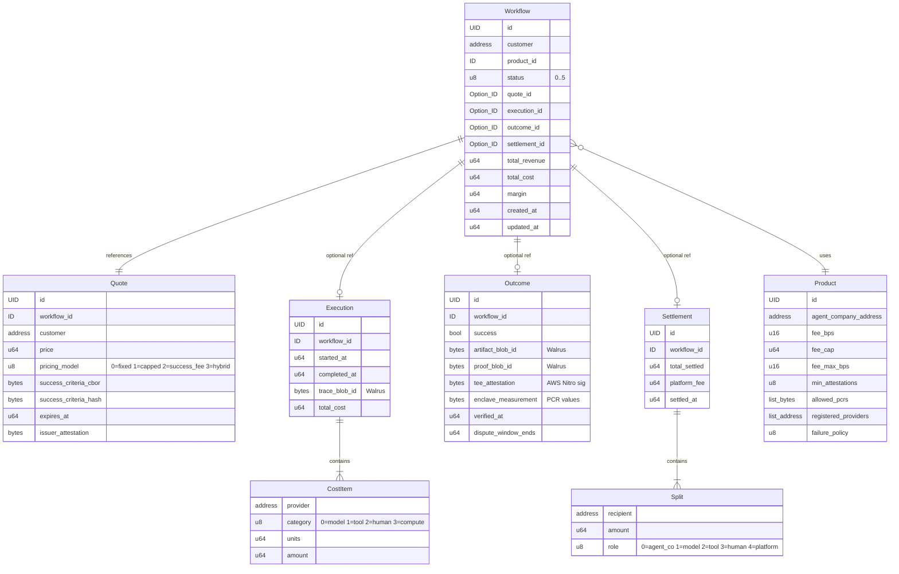

---

## 3. Workflow lifecycle (sequence)

End-to-end timeline of one billable workflow.

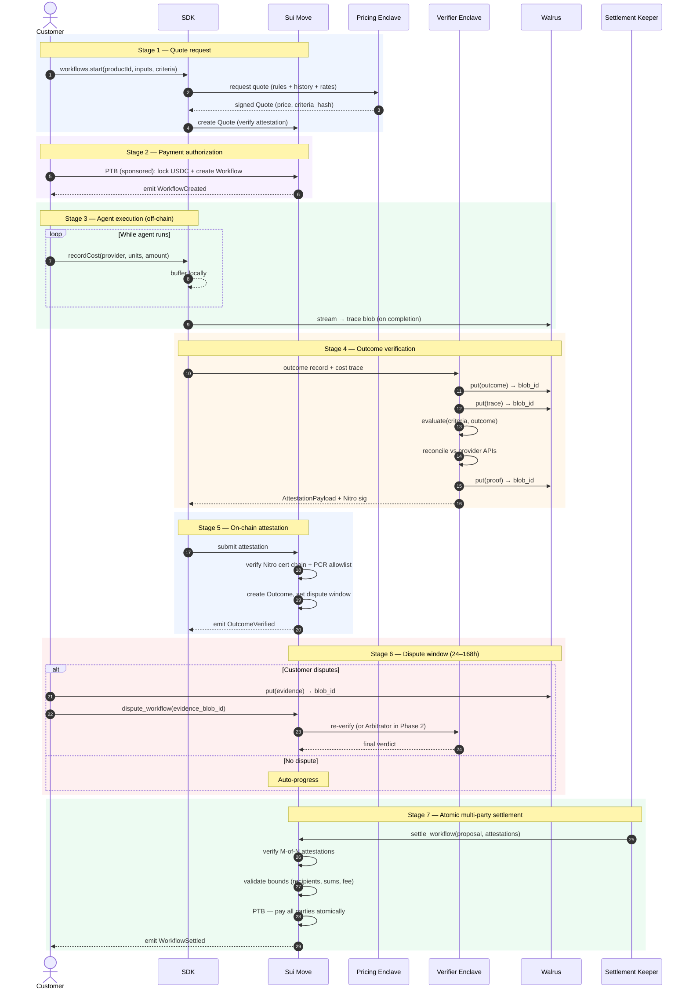

---

## 4. Workflow state machine

`Workflow.status` transitions. Status values match the on-chain `u8`.

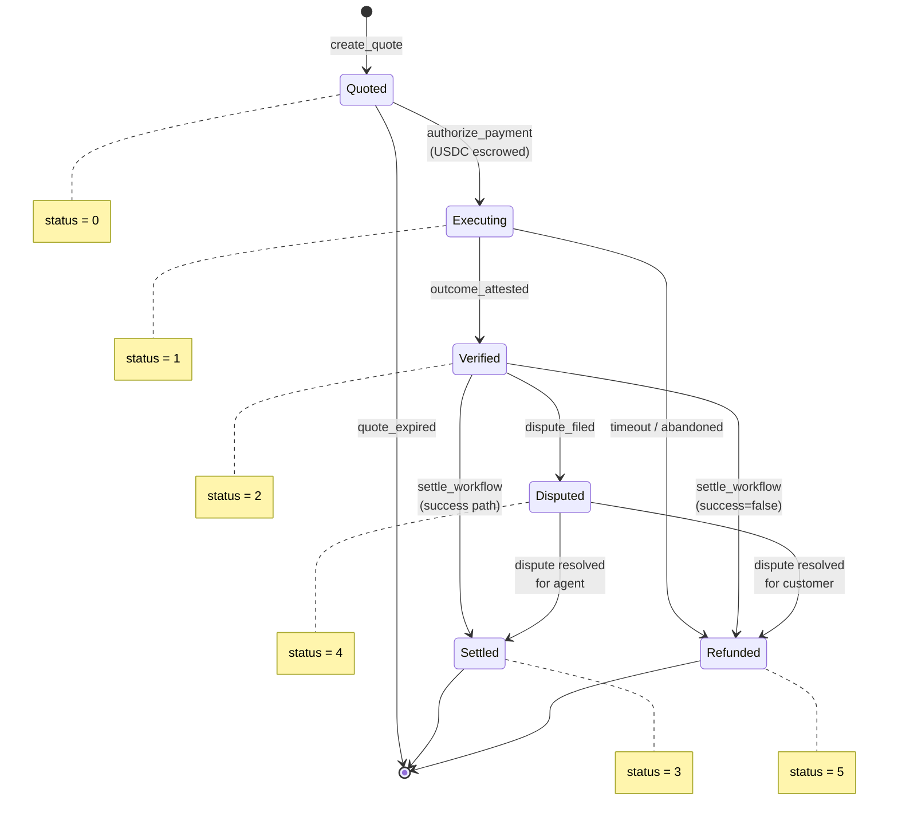

---

## 5. Settlement algorithm (flowchart)

Visualization of `ARCHITECTURE.md` §10.3 — the atomic multi-party settlement function in Move.

```mermaid
flowchart TD
    Start([settle_workflow called]) --> S0{status == VERIFIED?}
    S0 -- No --> A1[ABORT: not ready]
    S0 -- Yes --> S1{now ≥ dispute_window_ends?}
    S1 -- No --> A2[ABORT: window open]
    S1 -- Yes --> S2{open_dispute_count == 0?}
    S2 -- No --> A3[ABORT: in dispute]
    S2 -- Yes --> S3[Verify M-of-N attestations]

    S3 --> S3a{All sigs valid?<br/>PCRs in allowlist?<br/>Distinct enclave instances?<br/>Nonce matches proposal?}
    S3a -- No --> A4[ABORT: bad attestation]
    S3a -- Yes --> S4{proposal.outcome_success?}

    S4 -- No --> R1[Full refund:<br/>escrow.balance → customer]
    R1 --> R2[status = REFUNDED]
    R2 --> R3([emit WorkflowRefunded])

    S4 -- Yes --> S5[Check each split:<br/>amount > 0<br/>recipient ≠ customer]
    S5 --> S6{All recipients<br/>registered?}
    S6 -- No --> A5[ABORT: unknown recipient]
    S6 -- Yes --> S7{sum_splits ≤ escrow<br/>sum_splits ≤ quote.price<br/>fee ≤ cap<br/>fee ≤ max_bps}
    S7 -- No --> A6[ABORT: bounds violated]
    S7 -- Yes --> S8{provider_total ==<br/>reconciled_total?}
    S8 -- No --> A7[ABORT: cost mismatch]
    S8 -- Yes --> D1[Atomic disbursement PTB:<br/>• coin_split each provider<br/>• transfer agent_company share<br/>• transfer platform_fee<br/>• residual → customer]
    D1 --> C1[Create Settlement object]
    C1 --> C2[status = SETTLED<br/>update margin, revenue, cost]
    C2 --> C3([emit WorkflowSettled])

    style A1 fill:#3a1818,stroke:#ef4444
    style A2 fill:#3a1818,stroke:#ef4444
    style A3 fill:#3a1818,stroke:#ef4444
    style A4 fill:#3a1818,stroke:#ef4444
    style A5 fill:#3a1818,stroke:#ef4444
    style A6 fill:#3a1818,stroke:#ef4444
    style A7 fill:#3a1818,stroke:#ef4444
    style R3 fill:#3a2818,stroke:#f59e0b
    style C3 fill:#183a21,stroke:#22c55e
```

---

## 6. Outcome verification (flowchart)

Visualization of `ARCHITECTURE.md` §11.3 — runs inside the Nautilus enclave. **Yellow** = Phase 2.

```mermaid
flowchart TD
    Start([SDK submits outcome + cost trace]) --> T1{sha256 criteria<br/>== criteria_hash?}
    T1 -- No --> F1([REJECT: tampered criteria])
    T1 -- Yes --> St1[Walrus.put outcome → blob_id]
    St1 --> St2[Walrus.put trace → blob_id]
    St2 --> E1[Decode CBOR criteria]
    E1 --> Eval{Recurse on criterion}

    Eval -- exact --> P1[Compare value at JSON Pointer]
    Eval -- regex --> P2[RE2 match at JSON Pointer]
    Eval -- json_schema --> P3[JSON Schema 2020-12 validate]
    Eval -- numeric_threshold --> P4[Coerce to number, apply op]
    Eval -- semantic_match --> P5[Multi-LLM voting]
    Eval -- all_of / any_of / not --> P6[Recurse on children<br/>boolean compose]

    P5 --> LLM1[Call Claude API<br/>TLS-attested]
    P5 --> LLM2[Call GPT API<br/>TLS-attested]
    P5 --> LLM3[Call Gemini API<br/>TLS-attested]
    LLM1 --> V1{≥ 2 of 3 match<br/>with confidence ≥ threshold?}
    LLM2 --> V1
    LLM3 --> V1

    P1 --> R1{success bool}
    P2 --> R1
    P3 --> R1
    P4 --> R1
    P6 --> R1
    V1 --> R1

    R1 --> Rec[Reconcile costs:<br/>fetch_provider_usage per item]
    Rec --> SP{success?}
    SP -- Yes --> CS[compute_splits<br/>quote.price + reconciled + product]
    SP -- No --> ES[splits = empty]
    CS --> Pf[Build proof blob:<br/>evaluation_trace +<br/>llm_judgments +<br/>reconciliation_diffs +<br/>nonce]
    ES --> Pf
    Pf --> Pf2[Walrus.put proof → blob_id]
    Pf2 --> Sg[nitro_sign sha256 payload]
    Sg --> Out([Return AttestationPayload +<br/>signature + PCR])

    style P5 fill:#3a2818,stroke:#f59e0b
    style LLM1 fill:#3a2818,stroke:#f59e0b
    style LLM2 fill:#3a2818,stroke:#f59e0b
    style LLM3 fill:#3a2818,stroke:#f59e0b
    style V1 fill:#3a2818,stroke:#f59e0b
    style F1 fill:#3a1818,stroke:#ef4444
    style Out fill:#183a21,stroke:#22c55e
```

---

## 7. Success criteria DSL tree

The tagged-union schema. Composable predicates over the outcome record.

```mermaid
flowchart LR
    Root[SuccessCriterion] --> Leaf[Leaf predicates]
    Root --> Comp[Compositions]

    Leaf --> L1["exact<br/>{ path, value }"]
    Leaf --> L2["regex<br/>{ path, pattern, flags? }"]
    Leaf --> L3["json_schema<br/>{ schema }"]
    Leaf --> L4["numeric_threshold<br/>{ path, op, value }"]
    Leaf --> L5["semantic_match (Phase 2)<br/>{ path, expected, threshold }"]

    Comp --> C1["all_of<br/>{ criteria: [...] }"]
    Comp --> C2["any_of<br/>{ criteria: [...] }"]
    Comp --> C3["not<br/>{ criterion }"]

    style L5 fill:#3a2818,stroke:#f59e0b
```

**Example** — "ticket closed AND refund ≤ $100":

```json
{
  "type": "all_of",
  "criteria": [
    { "type": "exact",             "path": "/ticket_status",  "value": "closed" },
    { "type": "numeric_threshold", "path": "/refund_amount",  "op": "<=", "value": 100 }
  ]
}
```

---

## 8. Money flow (USDC)

How customer USDC flows through escrow and out to all parties on success vs failure.

```mermaid
flowchart LR
    subgraph Authz["Stage 2 — Payment authz"]
        Cust1["Customer wallet<br/>(USDC)"] -- "PTB locks" --> Esc[("Escrow<br/>= quote.price")]
    end

    subgraph Success["Stage 7 — Success path"]
        Esc1[("Escrow")] -- "split.amount per CostItem" --> Mod["Model providers<br/>(OpenAI, Anthropic, ...)"]
        Esc1 -- "split.amount per CostItem" --> Tool["Tool APIs<br/>(Zendesk, Salesforce, ...)"]
        Esc1 -- "split.amount per CostItem" --> Hum["Human-in-the-loop<br/>reviewers"]
        Esc1 -- "platform_fee" --> Plat["Platform treasury"]
        Esc1 -- "remainder = revenue − costs − fee" --> Ag["Agent company"]
        Esc1 -- "residual (rounding)" --> Cust2["Customer"]
    end

    subgraph Failure["Stage 7 — Failure path (MVP)"]
        Esc2[("Escrow")] -- "full balance" --> Cust3["Customer"]
        Note["Agent company eats provider costs<br/>(MVP failure_policy = full_refund)"]
    end

    Esc -.-> Esc1
    Esc -.-> Esc2

    style Esc fill:#1a1d2e,stroke:#a855f7
    style Esc1 fill:#1a1d2e,stroke:#a855f7
    style Esc2 fill:#1a1d2e,stroke:#a855f7
    style Plat fill:#183a21,stroke:#22c55e
    style Ag fill:#183a21,stroke:#22c55e
    style Cust3 fill:#3a2818,stroke:#f59e0b
```

---

## 9. Trust boundaries

Who is trusted for what — and what they're explicitly **not** trusted for. Pulled from `ARCHITECTURE.md` §9.1 (Security & Trust Model).

```mermaid
flowchart TB
    subgraph Trustless["🟢 TRUSTLESS — provable on-chain"]
        Sui["Sui Move contracts<br/>(public source, audited)"]
        Objs["Move objects<br/>(immutable history)"]
    end

    subgraph Attested["🟡 ATTESTED — cryptographically verifiable"]
        Encl["Nautilus enclaves<br/>(reproducible build, PCR on-chain)"]
        TLS["Multi-LLM TLS-attested calls<br/>(Phase 2)"]
    end

    subgraph TrustedOps["🟠 TRUSTED OPERATIONALLY — auditable but centralized"]
        IndexerT["Event indexer<br/>(read-only mirror)"]
        APIT["Customer API"]
        KeeperT["Settlement keeper<br/>(triggering only, no authority)"]
        WalrusT["Walrus<br/>(epoch-bounded durability)"]
    end

    subgraph Untrusted["🔴 UNTRUSTED — reconciled / verified"]
        SDKT["Customer SDK<br/>(reports costs)"]
        AgentT["Agent runtime<br/>(reports outcomes)"]
        Validators["Sui validators<br/>(ordering / finality only)"]
    end

    SDKT -- "costs reconciled by" --> Workers2["Cost ingestion workers"]
    Workers2 --> Encl
    AgentT -- "outcomes verified by" --> Encl
    Encl -- "attestation verified by" --> Sui
    Sui -- "settlement enforced by" --> Objs
    KeeperT -- "triggers but cannot mutate" --> Sui
    IndexerT -. "read-only" .-> Objs
    Validators -- "ordering" --> Sui

    style Trustless fill:#0a2a16,stroke:#22c55e
    style Attested fill:#2a2010,stroke:#f59e0b
    style TrustedOps fill:#2a2818,stroke:#eab308
    style Untrusted fill:#2a1010,stroke:#ef4444
```

**Key invariant:** even if every Untrusted *and* every TrustedOps component is fully compromised, **funds cannot move incorrectly** — the Trustless tier (Move contracts) enforces all settlement invariants, and the Attested tier produces evidence the Trustless tier verifies.

---

## 10. Frontend route map

Every Next.js route and its purpose. Routes already scaffolded (UI-only, no data layer yet) shown solid; future routes dashed.

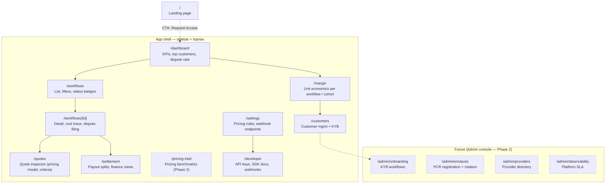

---

## 11. Build phase timeline (Gantt)

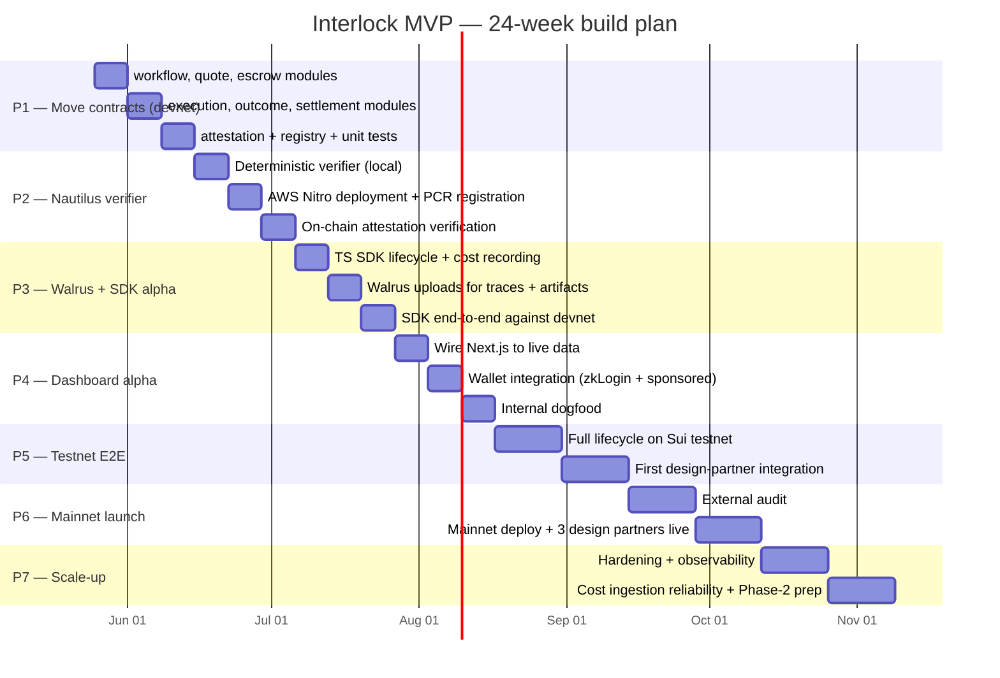

---

## 12. Repository layout

```
interlock-new/
├── CLAUDE.md                 # Project identity, locked decisions, phase pointer
├── AGENTS.md                 # Next.js 16 breaking-change warning
├── ARCHITECTURE.md           # Full spec mirror of the docx
├── DIAGRAMS.md               # This file
├── README.md
│
├── src/                      # Next.js 16 + React 19 frontend
│   ├── app/
│   │   ├── page.tsx                  # Landing
│   │   ├── dashboard/
│   │   ├── workflows/
│   │   │   └── [id]/
│   │   ├── quotes/
│   │   ├── settlement/
│   │   ├── margin/
│   │   ├── customers/
│   │   ├── pricing-intel/    # Phase 2
│   │   ├── developer/
│   │   └── settings/
│   └── components/
│
├── backend/
│   ├── technical_architecture.docx   # Source of truth doc
│   │
│   ├── move/                 # Single Sui Move package: interlock
│   │   ├── Move.toml
│   │   └── sources/
│   │       ├── types.move            # Enums, error codes, shared types
│   │       ├── workflow.move
│   │       ├── quote.move
│   │       ├── escrow.move
│   │       ├── execution.move
│   │       ├── outcome.move
│   │       ├── settlement.move       # § 10 implementation
│   │       ├── attestation.move      # § 11.6 implementation
│   │       └── registry.move
│   │
│   ├── enclaves/             # Nautilus services
│   │   ├── outcome-verifier/         # MVP
│   │   ├── pricing-engine/           # Phase 2
│   │   └── dispute-arbitrator/       # Phase 2
│   │
│   ├── indexer/              # Sui event indexer → Postgres
│   ├── api/                  # tRPC + REST + GraphQL
│   └── workers/              # Cost ingestion + webhook delivery + keeper
│
└── packages/
    └── sdk/                  # @platform/sdk (TypeScript first)
```

---

## 13. Feature coverage matrix

Every feature mentioned in `backend/technical_architecture.docx` mapped to where it lives in this repo. Use this to confirm nothing is missing.

| # | Feature | Doc § | ARCHITECTURE.md | Move module | Enclave | Off-chain | Frontend | Phase |
|---|---|---|---|---|---|---|---|---|
| **Architecture** | | | | | | | | |
| 1 | 3-plane split (Sui / Nautilus / Walrus) | 1.1 | §1 | — | — | — | — | P1 |
| 2 | Off-chain services plane | 1.1 | §1, §4.4 | — | — | indexer + api + workers | — | P3+ |
| **Data model — Move objects** | | | | | | | | |
| 3 | Workflow object | 2.1 | §2 | `workflow` | — | indexer | dashboard | P1 |
| 4 | Quote object | 2.1 | §2 | `quote` | pricing | indexer | quotes | P1 |
| 5 | Execution object | 2.1 | §2 | `execution` | — | workers | workflows | P1 |
| 6 | CostItem value type | 2.1 | §2 | `execution` | verifier | workers | workflows | P1 |
| 7 | Outcome object | 2.1 | §2 | `outcome` | verifier | indexer | workflows | P1 |
| 8 | Settlement object | 2.1 | §2 | `settlement` | verifier | keeper | settlement | P1 |
| 9 | Split value type | 2.1 | §2 | `settlement` | verifier | — | settlement | P1 |
| 10 | Product (registry) object | 4.1 | §2, §10 | `registry` | — | api | admin | P1 |
| 11 | Parallel-execution object capability | 2.2 | §2.2 | all | — | — | — | P1 |
| 12 | Walrus blob IDs as foreign keys | 2.2 | §2.2, §4.3 | `execution`, `outcome` | verifier | — | — | P3 |
| **Workflow lifecycle (7 stages)** | | | | | | | | |
| 13 | Stage 1 — Quote request | 3.1 | §3 | `quote` | pricing | sdk | quotes | P2 (pricing P2) |
| 14 | Stage 2 — Payment authorization (PTB + USDC lock) | 3.2 | §3 | `escrow`, `workflow` | — | sdk | dashboard | P1 |
| 15 | Sponsored transactions | 3.2 | §6.3 | — | — | sponsor svc | wallet flow | P4 |
| 16 | Stage 3 — Agent execution (off-chain cost stream) | 3.3 | §3 | — | — | api buffer | — | P3 |
| 17 | Stage 4 — Outcome verification (TEE) | 3.4 | §3, §11 | — | verifier | — | — | P2 |
| 18 | Stage 5 — On-chain attestation verification | 3.5 | §3, §11.6 | `attestation` | — | — | — | P2 |
| 19 | Stage 6 — Dispute window | 3.6 | §3 | `outcome` | arbitrator (P2) | — | workflows | P1 + P2 |
| 20 | Stage 7 — Atomic multi-party settlement | 3.7 | §3, §10 | `settlement` | — | keeper | settlement | P1 |
| **Move modules (8)** | | | | | | | | |
| 21 | billing::workflow | 4.1 | §4.1 | ✅ | — | — | — | P1 |
| 22 | billing::quote | 4.1 | §4.1 | ✅ | — | — | — | P1 |
| 23 | billing::escrow | 4.1 | §4.1 | ✅ | — | — | — | P1 |
| 24 | billing::execution | 4.1 | §4.1 | ✅ | — | — | — | P1 |
| 25 | billing::outcome | 4.1 | §4.1 | ✅ | — | — | — | P1 |
| 26 | billing::settlement | 4.1 | §4.1, §10 | ✅ | — | — | — | P1 |
| 27 | billing::attestation | 4.1 | §4.1, §11.6 | ✅ | — | — | — | P1 |
| 28 | billing::registry | 4.1 | §4.1 | ✅ | — | — | — | P1 |
| **Nautilus enclave services (3)** | | | | | | | | |
| 29 | Pricing engine | 4.2 | §4.2 | — | ✅ | — | — | P2 |
| 30 | Outcome verifier | 4.2 | §4.2, §11 | — | ✅ | — | — | P2 |
| 31 | Dispute arbitrator | 4.2 | §4.2 | — | ✅ | — | — | P2 |
| 32 | Reproducible builds + PCR registration | 4.2 | §4.2, §11.6 | `attestation` | all enclaves | admin | admin | P2 |
| 33 | M-of-N attestation | 7.2 | §11.7 | `attestation` | verifier | — | — | P1 schema, P2 enforcement |
| **Walrus storage (4 tiers)** | | | | | | | | |
| 34 | Active tier (1 epoch) | 4.3 | §4.3 | — | verifier | workers | — | P3 |
| 35 | Recent tier (7 epochs) | 4.3 | §4.3 | — | — | workers | dashboards | P3 |
| 36 | Audit tier (53 epochs) | 4.3 | §4.3 | — | — | workers | — | P5 |
| 37 | Archive tier (S3 Glacier) | 4.3 | §4.3 | — | — | workers | — | P7 |
| **Off-chain services (4)** | | | | | | | | |
| 38 | Event indexer | 4.4 | §4.4 | — | — | ✅ indexer | — | P3 |
| 39 | Cost ingestion workers | 4.4 | §4.4 | — | — | ✅ workers | — | P3 |
| 40 | Webhook delivery | 4.4 | §4.4 | — | — | ✅ workers | — | P3 |
| 41 | Customer API (REST + GraphQL + tRPC) | 4.4 | §4.4 | — | — | ✅ api | — | P4 |
| 42 | Settlement keeper | §10.4 | §10.4 | — | — | ✅ workers | — | P1 |
| **Frontend** | | | | | | | | |
| 43 | Customer dashboard | 5.1 | §7.1 | — | — | api | ✅ src/app | scaffolded → P4 |
| 44 | Workflow list + status + margin | 5.1 | §7.1 | — | — | api | workflows | scaffolded → P4 |
| 45 | Real-time unit economics | 5.1 | §7.1 | — | — | api | margin | scaffolded → P4 |
| 46 | Quote inspector | 5.1 | §7.1 | — | — | api | quotes | scaffolded → P4 |
| 47 | Dispute filing UI (Walrus upload) | 5.1 | §7.1 | — | — | api | workflows | P4–P5 |
| 48 | Settings (API keys, webhooks, pricing rules) | 5.1 | §7.1 | — | — | api | settings | scaffolded → P4 |
| 49 | Finance: invoice, RevRec, COGS | 5.1 | §7.1 | — | — | api | settlement | P5–P7 |
| 50 | Admin console (KYB, PCRs, providers, SLA) | 5.1 | §7.1 | — | — | api | (Phase 2) | P7+ |
| **Frontend stack** | | | | | | | | |
| 51 | Next.js 15+ App Router + RSC | 5.2 | §7.2 | — | — | — | ✅ (16.2.6) | done |
| 52 | TypeScript strict | 5.2 | §7.2 | — | — | — | ✅ | done |
| 53 | @mysten/sui (PTBs + queries) | 5.2 | §7.2 | — | — | — | P4 | P4 |
| 54 | @mysten/dapp-kit (wallet) | 5.2 | §7.2 | — | — | — | P4 | P4 |
| 55 | @mysten/walrus | 5.2 | §7.2 | — | — | — | P4 | P4 |
| 56 | Tailwind v4 + shadcn/ui | 5.2 | §7.2 | — | — | — | ✅ Tailwind v4 | done |
| 57 | TanStack Query + RSC | 5.2 | §7.2 | — | — | — | P4 | P4 |
| 58 | Recharts | 5.2 | §7.2 | — | — | — | ✅ | done |
| 59 | zkLogin (Google, Apple) | 5.3 | §7.3 | — | — | — | P4 | P4 |
| 60 | Sponsored transactions | 5.3 | §7.3 | — | — | sponsor svc | wallet flow | P4 |
| 61 | Multi-sig for enterprise | 5.3 | §7.3 | — | — | — | P7 | P7 |
| **SDK** | | | | | | | | |
| 62 | TypeScript SDK core API | 6.1 | §8.1 | — | — | — | packages/sdk | P3 |
| 63 | Cost event buffering + batch submit | 6.2 | §8.2 | — | — | — | sdk | P3 |
| 64 | PTB construction for quote + settlement | 6.2 | §8.2 | — | — | — | sdk | P3 |
| 65 | TEE communication helpers | 6.2 | §8.2 | — | — | — | sdk | P3 |
| 66 | Walrus artifact upload | 6.2 | §8.2 | — | — | — | sdk | P3 |
| 67 | Webhook signature validation hooks | 6.2 | §8.2 | — | — | — | sdk | P3 |
| 68 | Python SDK | 6.3 | §8.3 | — | — | — | packages/sdk-py | P3.5 |
| 69 | Go + Rust SDKs | 6.3 | §8.3 | — | — | — | (Phase 2) | P7+ |
| **Security & trust** | | | | | | | | |
| 70 | Trust matrix (5 components) | 7.1 | §9.1 | — | — | — | — | doc only |
| 71 | Attack: customer underreports costs → reconciliation | 7.2 | §9.2 | — | verifier | workers | — | P2–P3 |
| 72 | Attack: customer frivolous dispute → dispute bond | 7.2 | §9.2 | `outcome` | arbitrator | — | — | P5 |
| 73 | Attack: agent manipulates outcome → TEE verification | 7.2 | §9.2 | `attestation` | verifier | — | — | P2 |
| 74 | Attack: TEE compromise → PCR rotation + M-of-N | 7.2 | §9.2, §11.7 | `attestation` | verifier | — | admin | P2 + ongoing |
| 75 | Attack: Walrus data loss → secondary replication | 7.2 | §9.2 | — | — | workers | — | P5+ |
| 76 | Seal for persistent enclave keys | 7.1, 10 | §9.1, §12 | — | all enclaves | — | — | P2 |
| **Algorithms (new in §10/§11)** | | | | | | | | |
| 77 | Hybrid settlement: enclave proposes, Move validates | — | §10.1 | `settlement` | verifier | — | — | P1 + P2 |
| 78 | Settlement preconditions + bounds checks | — | §10.3 | `settlement` | — | — | — | P1 |
| 79 | Permissionless settlement trigger | — | §10.4 | `settlement` | — | keeper | — | P1 |
| 80 | Failure-mode matrix (8 modes) | — | §10.5 | — | — | — | — | doc only |
| 81 | Pricing-model forward-compat (4 models) | 2.1 | §10.6 | `quote`, `settlement` | — | — | quotes | P1 fixed only |
| 82 | PTB-size aggregation strategy | — | §10.7 | — | — | sdk | — | P3 |
| 83 | Success criteria DSL (tagged union) | 2.1, 3.4 | §11.2 | `quote` (bytes) | verifier | sdk | quotes | P1 schema, P2 eval |
| 84 | Deterministic evaluation primitives | 3.4 | §11.4 | — | verifier | — | — | P2 |
| 85 | Multi-LLM voting for semantic_match | — | §11.5 | — | verifier | — | — | Phase 2 |
| 86 | Attestation binding (workflow_id + timestamp + nonce) | — | §11.6 | `attestation` | verifier | — | — | P2 |
| 87 | PCR allowlist + rolling upgrade procedure | 4.2 | §11.6 | `attestation`, `registry` | — | admin | admin | P2 |
| 88 | Properties / threat-model checklist (8) | — | §11.8 | — | — | — | — | doc only |
| **Deployment & ops** | | | | | | | | |
| 89 | Environments: dev / staging / prod | 8.1 | §10.1 | — | — | — | — | per phase |
| 90 | AWS Nitro EC2 m5a.xlarge, 3+ replicas, 2+ regions | 8.2 | §10.2 | — | infra | — | — | P5 |
| 91 | Kubernetes on EKS, multi-region active-active | 8.2 | §10.2 | — | — | infra | — | P5 |
| 92 | Postgres on Aurora + Redis | 8.2 | §10.2 | — | — | indexer + api | — | P3 |
| 93 | Vercel frontend, server actions for Sui txs | 8.2 | §10.2 | — | — | — | infra | P4 |
| 94 | OpenTelemetry traces | 8.3 | §10.3 | — | — | all | sdk | P5 |
| 95 | Datadog dashboards | 8.3 | §10.3 | — | — | — | — | P5 |
| 96 | PagerDuty on-call + runbooks | 8.3 | §10.3 | — | — | — | — | P6 |
| **MVP scope** | | | | | | | | |
| 97 | MVP in-scope checklist (9 items) | 9.1 | §11.1 | — | — | — | — | covered above |
| 98 | MVP out-of-scope deferred (7 items) | 9.2 | §11.2 | — | — | — | — | Phase 2+ |
| 99 | 24-week milestones (7 phases) | 9.3 | §11.3 | — | — | — | — | this doc § 11 |
| **Open questions** | | | | | | | | |
| 100 | High-frequency batching strategy | 10 | §12.1 | future | — | — | — | TBD |
| 101 | USDC vs USDT vs SUI-native | 10 | §12.2 | future | — | — | — | TBD |
| 102 | Self-hosted Walrus publisher decision point | 10 | §12.3 | — | — | infra | — | TBD |
| 103 | Seal-based enclave key rotation | 10 | §12.4 | — | enclaves | — | — | P2 |
| 104 | Move package upgrade strategy | 10 | §12.5 | all | — | — | — | P1 prep |

**Counts:**
- ✅ Features specified in `ARCHITECTURE.md`: **104 / 104**
- ✅ Doc sections covered: **1–10 (entire doc)**
- ⚠ Items not yet implemented in code: **104** (we're entering P1)
- ⚠ Items not yet decided: **5** (§12 Open Questions)

---

## Legend

| Symbol | Meaning |
|---|---|
| 🟢 Trustless | Provable on-chain; no operator can override |
| 🟡 Attested | Cryptographically verifiable evidence (Nitro / TLS) |
| 🟠 Trusted ops | Auditable but centralized — failure degrades availability, not safety |
| 🔴 Untrusted | Output must be reconciled or verified before being relied on |
| ✅ | Specified and assigned |
| Dashed border | Future / Phase 2+ |
| Yellow fill | Phase 2 feature |
| Red fill | Abort / reject path |
| Green fill | Success terminal |

---

*Source diagrams are kept in this file as Mermaid text. When `ARCHITECTURE.md` or `backend/technical_architecture.docx` changes, update the matrix in §13 first, then regenerate any affected diagrams.*
